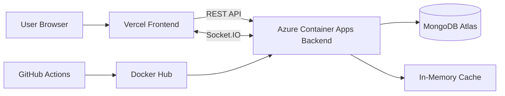
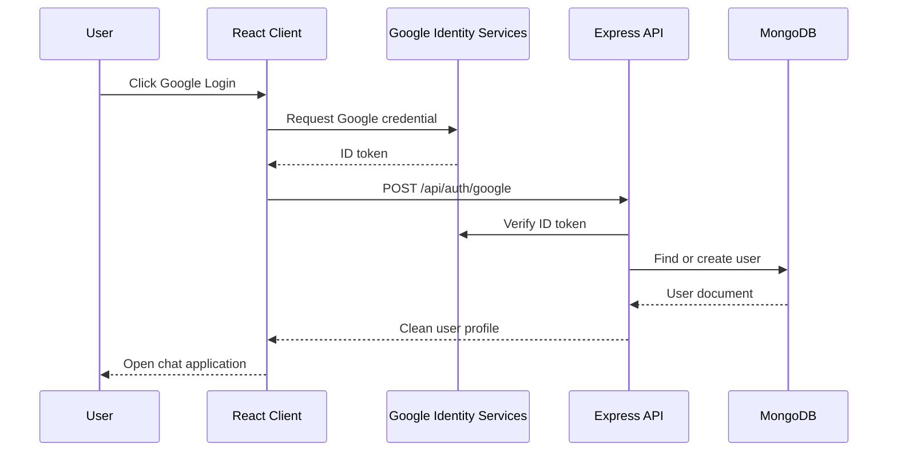
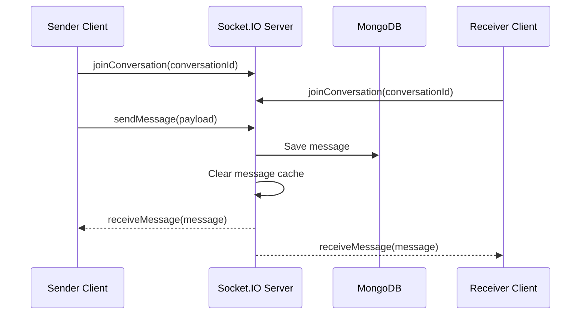
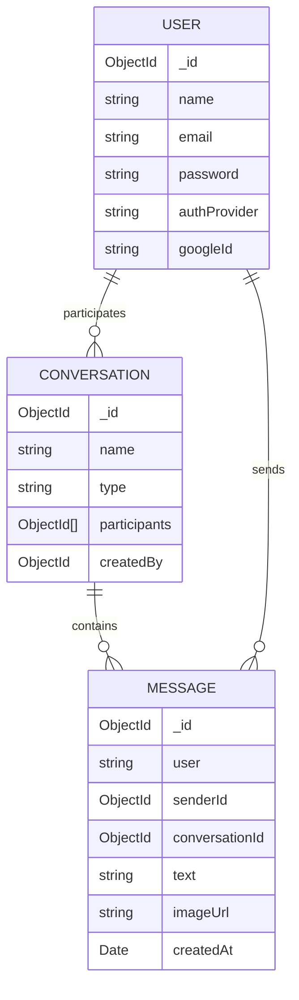
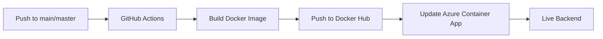

<p align="center">
  
</p>

# EchoLine

> A MERN real-time chat application for private conversations, group messaging, and live collaboration.


EchoLine is a full-stack real-time chat application built with the MERN stack. The app supports email/password login, Google authentication, direct messaging, group conversations, image messages, emojis, typing indicators, send sounds, search, Docker-based local development, backend CI/CD, Azure deployment, Vercel frontend hosting, caching, and rate limiting.

## Table Of Contents

- [Project Summary](#project-summary)
- [Live Architecture](#live-architecture)
- [Feature List](#feature-list)
- [Tech Stack](#tech-stack)
- [Folder Structure](#folder-structure)
- [System Diagrams](#system-diagrams)
- [Environment Variables](#environment-variables)
- [Run Locally](#run-locally)
- [Run With Docker](#run-with-docker)
- [API Documentation](#api-documentation)
- [Socket Events](#socket-events)
- [Database Models](#database-models)
- [Caching And Rate Limiting](#caching-and-rate-limiting)
- [Deployment](#deployment)
- [GitHub Actions CI/CD](#github-actions-cicd)
- [Google Authentication Setup](#google-authentication-setup)
- [Security Notes](#security-notes)
- [Known Limitations](#known-limitations)
- [Future Improvements](#future-improvements)

## Project Summary

EchoLine is a production-style MERN chat application designed for real-time communication between authenticated users.

The frontend is a Vite React application styled with Tailwind CSS and DaisyUI. The backend is an Express API with Socket.IO for live messaging. MongoDB stores users, conversations, and messages. The backend can be deployed as a Docker image to Azure Container Apps, while the frontend can be deployed to Vercel.

## Live Architecture

```text
Frontend: Vercel / Vite React
Backend: Azure Container Apps / Docker Hub image
Database: MongoDB Atlas
Realtime: Socket.IO
CI/CD: GitHub Actions -> Docker Hub -> Azure Container Apps
```

## Feature List

### Authentication

- Email and password registration
- Email and password login
- Google login using Google Identity Services
- Google ID token verification on the backend
- Local user persistence through browser storage
- Password hashing with Node.js crypto
- User model supports local and Google-authenticated users

### Chat Features

- One-to-one direct chat
- Group chat
- Leave group functionality
- Real-time messaging with Socket.IO
- Conversation-based message loading
- User list for starting direct chats
- Group creation with selected members
- Search chats and people from the sidebar
- Typing indicator animation
- Send sound after sending a message
- Emoji quick actions
- Image message support with preview before sending
- Message history loaded from MongoDB

### UI Features

- Professional messaging-app layout
- Left conversation sidebar
- Account header with avatar
- Chat header with status and action icons
- Icon-based login, logout, leave group, image upload, and send controls
- WhatsApp/Telegram-inspired message area
- Incoming and outgoing message bubble styling
- Responsive layout
- Empty states for chats, messages, and search results

### Backend Scalability Features

- API rate limiting
- Stricter auth route rate limiting
- JSON body size limit
- In-memory cache with TTL
- Cache invalidation on message and conversation changes
- Dockerized backend
- CI/CD for backend deployment

## Tech Stack

| Layer | Technology |
| --- | --- |
| Frontend | React 18, Vite |
| Styling | Tailwind CSS, DaisyUI |
| HTTP Client | Axios |
| Realtime Client | Socket.IO Client |
| Backend | Node.js, Express |
| Realtime Server | Socket.IO |
| Database | MongoDB |
| ODM | Mongoose |
| Authentication | Custom email/password auth, Google Identity Services |
| Rate Limiting | express-rate-limit |
| Caching | In-memory TTL cache |
| Containerization | Docker, Docker Compose |
| Backend Deployment | Azure Container Apps |
| Frontend Deployment | Vercel |
| Image Registry | Docker Hub |
| CI/CD | GitHub Actions |

## Folder Structure

```text
farhanaislamsaima/
  client/
    src/
      api/
      components/
      utils/
      App.jsx
      main.jsx
      styles.css
    package.json
    vite.config.js

  server/
    controllers/
    models/
    routes/
    utils/
    Dockerfile
    package.json
    server.js

  docker-compose.yml
  package.json
  package-lock.json
  README.md
```

## System Diagrams

### Application Architecture



### Authentication Flow



### Realtime Message Flow



### Data Model Overview



### Backend CI/CD Flow



## Environment Variables

### Server Environment

Create:

```text
farhanaislamsaima/server/.env
```

Example:

```env
MONGO_URI=mongodb+srv://<username>:<password>@<cluster-url>/<database-name>
PORT=4000
CLIENT_URL=http://localhost:5173
GOOGLE_CLIENT_ID=<your-google-client-id>.apps.googleusercontent.com
```

For Azure Container Apps, configure these as container app environment variables:

```text
MONGO_URI
PORT
CLIENT_URL
GOOGLE_CLIENT_ID
```

### Client Environment

Create:

```text
farhanaislamsaima/client/.env
```

Example:

```env
VITE_API_URL=http://localhost:4000/api
VITE_SOCKET_URL=http://localhost:4000
VITE_GOOGLE_CLIENT_ID=<your-google-client-id>.apps.googleusercontent.com
```

For Vercel, configure:

```text
VITE_API_URL=https://<your-azure-backend-url>/api
VITE_SOCKET_URL=https://<your-azure-backend-url>
VITE_GOOGLE_CLIENT_ID=<your-google-client-id>.apps.googleusercontent.com
```

## Run Locally

From the app folder:

```bash
cd farhanaislamsaima
npm install
npm run dev
```

Local URLs:

```text
Frontend: http://localhost:5173
Backend:  http://localhost:4000
```

Run only the frontend:

```bash
cd client
npm run dev
```

Run only the backend:

```bash
cd server
npm run dev
```

## Run With Docker

From:

```bash
cd farhanaislamsaima
```

Start all services:

```bash
docker compose up --build
```

Stop all services:

```bash
docker compose down
```

Docker Compose starts:

| Service | Port | Purpose |
| --- | --- | --- |
| `mongo` | `27017` | Local MongoDB |
| `server` | `4000` | Express API and Socket.IO server |
| `client` | `5173` | Vite React frontend |

## API Documentation

Base URL:

```text
http://localhost:4000/api
```

Production base URL:

```text
https://<your-azure-container-app-url>/api
```

### Auth Routes

| Method | Route | Description |
| --- | --- | --- |
| `POST` | `/auth/register` | Register with name, email, and password |
| `POST` | `/auth/login` | Login with email and password |
| `POST` | `/auth/google` | Login or register with Google ID token |

Example register body:

```json
{
  "name": "Farhana Islam",
  "email": "farhana@example.com",
  "password": "123456"
}
```

Example Google body:

```json
{
  "credential": "<google-id-token>"
}
```

### Conversation Routes

| Method | Route | Description |
| --- | --- | --- |
| `GET` | `/conversations/users` | Get all users for starting chats |
| `GET` | `/conversations?userId=<id>` | Get conversations for a user |
| `POST` | `/conversations` | Create direct or group conversation |
| `PATCH` | `/conversations/:id/leave` | Leave a group conversation |

Example direct chat body:

```json
{
  "creatorId": "user-id",
  "type": "direct",
  "participantIds": ["other-user-id"]
}
```

Example group chat body:

```json
{
  "creatorId": "user-id",
  "type": "group",
  "name": "Project Team",
  "participantIds": ["user-id-1", "user-id-2"]
}
```

Example leave group body:

```json
{
  "userId": "current-user-id"
}
```

### Message Routes

| Method | Route | Description |
| --- | --- | --- |
| `GET` | `/messages?conversationId=<id>` | Get latest messages for a conversation |
| `POST` | `/messages` | Create a message through REST API |

Example message body:

```json
{
  "conversationId": "conversation-id",
  "senderId": "user-id",
  "user": "Farhana Islam",
  "text": "Hello",
  "imageUrl": "data:image/png;base64,..."
}
```

## Socket Events

| Event | Direction | Description |
| --- | --- | --- |
| `joinConversation` | Client to server | Join a Socket.IO room for a conversation |
| `leaveConversation` | Client to server | Leave a Socket.IO room |
| `sendMessage` | Client to server | Send a realtime message |
| `receiveMessage` | Server to client | Receive a realtime message |
| `typing` | Client to server, server to clients | Notify others that a user is typing |
| `stopTyping` | Client to server, server to clients | Stop typing notification |
| `disconnect` | Socket.IO lifecycle | User socket disconnected |

## Database Models

### User

Stores account data for local and Google users.

Important fields:

```text
name
email
password
authProvider
googleId
```

### Conversation

Stores direct and group chats.

Important fields:

```text
name
type: direct | group
participants
createdBy
```

### Message

Stores chat messages.

Important fields:

```text
user
senderId
conversationId
text
imageUrl
createdAt
```

## Caching And Rate Limiting

### Rate Limiting

The backend uses `express-rate-limit`.

| Route Scope | Limit |
| --- | --- |
| `/api/*` | 300 requests per 15 minutes |
| `/api/auth/*` | 40 requests per 15 minutes |

This helps protect the API from excessive requests and repeated login attempts.

### Caching

The backend includes an in-memory TTL cache.

| Cache Key | TTL | Purpose |
| --- | --- | --- |
| `users:list` | 60 seconds | Avoid repeated user list database reads |
| `conversations:<userId>` | 30 seconds | Cache user conversation list |
| `messages:<conversationId>` | 15 seconds | Cache recent messages |

Cache invalidation happens when:

- a conversation is created
- a group is left
- a message is sent through REST or Socket.IO

For a larger production system with multiple backend replicas, Redis would be the next step for shared caching, shared rate limiting, Socket.IO scaling, and presence tracking.

## Deployment

### Frontend: Vercel

Vercel project settings:

```text
Framework Preset: Vite
Root Directory: farhanaislamsaima/client
Build Command: npm run build
Output Directory: dist
Install Command: npm install
```

Required Vercel environment variables:

```text
VITE_API_URL
VITE_SOCKET_URL
VITE_GOOGLE_CLIENT_ID
```

### Backend: Azure Container Apps

The backend is deployed as a Docker image.

Docker Hub image:

```text
docker.io/farhanasaima2110047/chatapp-server
```

Example deployment:

```bash
az containerapp up \
  --name chatapp-server \
  --resource-group chatapp-rg \
  --location centralindia \
  --image docker.io/farhanasaima2110047/chatapp-server:latest \
  --target-port 4000 \
  --ingress external
```

Required Azure environment variables:

```text
MONGO_URI
PORT
CLIENT_URL
GOOGLE_CLIENT_ID
```

## GitHub Actions CI/CD

Workflow file:

```text
.github/workflows/farhana-backend-deploy.yml
```

The workflow:

1. Runs on push to `main` or `master`
2. Checks required secrets
3. Builds the backend Docker image
4. Pushes the image to Docker Hub
5. Logs in to Azure
6. Updates the Azure Container App image

Required GitHub secrets:

```text
DOCKERHUB_TOKEN
AZURE_CREDENTIALS
```

The Docker Hub username is stored in the workflow:

```text
farhanasaima2110047
```

## Google Authentication Setup

1. Open Google Cloud Console.
2. Create or select a project.
3. Configure OAuth consent screen.
4. Create OAuth client ID.
5. Select Web application.
6. Add authorized JavaScript origins:

```text
http://localhost:5173
https://<your-vercel-domain>.vercel.app
```

7. Copy the client ID.
8. Add it to:

```text
client/.env -> VITE_GOOGLE_CLIENT_ID
server/.env -> GOOGLE_CLIENT_ID
Vercel -> VITE_GOOGLE_CLIENT_ID
Azure Container Apps -> GOOGLE_CLIENT_ID
```

## Security Notes

- Do not commit `.env` files.
- Rotate secrets if they are exposed.
- Use Docker Hub access tokens instead of account passwords.
- Use Azure environment variables or secrets for production configuration.
- MongoDB Atlas should restrict network access in production.
- The current app uses simple local storage for user state, which is suitable for demo use but not a full production session system.
- Image messages are stored as data URLs and limited to small files. Production systems should use object storage such as Cloudinary or Azure Blob Storage.

## Known Limitations

- In-memory cache is per container instance.
- Rate limiting is per container instance.
- Socket.IO is not configured for multiple backend replicas.
- Local storage auth is not equivalent to secure JWT/session auth.
- Image upload is demo-friendly but not production-grade storage.

## Future Improvements

- JWT or secure cookie-based sessions
- Redis for shared cache, shared rate limiting, and Socket.IO adapter
- Online/offline presence
- Read receipts
- Message reactions
- Message delete/edit
- User profile photos
- Cloudinary or Azure Blob Storage for images
- Admin controls for groups
- Unit and integration tests
- End-to-end tests with Playwright
